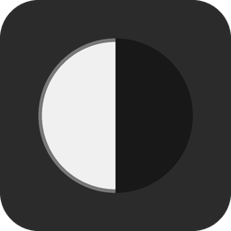

# QuickWB

Open, drag or paste an image in, white-balance it, and export it or copy it to
the clipboard. A small single-window desktop app (PySide6) with a dark UI.



Works on one image or on a batch: **Separately** gives each image its own
correction, **All together** computes one shared correction for the whole
selection so a set stays consistent.

## What it does

- **Drop, open, or paste** images (PNG, JPG, TIFF, BMP, WebP). Drag several
  in at once, or **paste** with **Ctrl+V** — a screenshot, a copied image, or
  copied files.
- **One image at a time, or a gallery.** **Single** shows the current slot at
  window size, with **◀ / ▶** (or the arrow keys) and a `3 / 7` counter
  naming the file. **Grid** lays every slot out side by side and scrolls;
  loading several images at once switches to it for you.
  Double-click any image for a full-screen view — scroll to zoom,
  drag to pan, Esc to close.
- **Slots.** `+ add another slot` appends an empty drop zone and takes you
  to it; **Delete** removes any selected slot, and the last image clears back
  to a drop zone instead of leaving you stuck with it. Click to select,
  **Ctrl+click** to add, **Shift+click** for a range, **Ctrl+A** for the lot,
  and a click on the background (or **Deselect**) to select nothing. The
  active tile is ringed; every control acts on the selection.
- **Ctrl+Z** undoes the last open, paste or delete — pasting onto the wrong
  slot is one keystroke to fix. **Ctrl+Shift+Z** (or Ctrl+Y) puts it back:
  images you undo away are kept, so deleting and changing your mind costs
  nothing.
- **White point → Auto** estimates the neutral colour from the image itself;
  the **De-cast** slider sets how hard it looks (brightest pixels only ↔
  whole frame).
  Once a correction has been computed the section shows the colour it settled
  on — a swatch, its hex value, and where it came from.
- **White point → Pick…** is an eyedropper: click something that *should*
  be grey or white. In **All together** mode one pick sets the white point
  for the whole selection.
- **Recompute** re-runs the correction, with a marker showing whether the
  preview is current: **green** = matches the settings, **amber** = something
  changed since the last pass. Leave **Auto** ticked and it recomputes as you
  go; untick it for big batches, and images you load then stay untouched on
  screen until you press it — while nothing has been computed the button
  reads **Compute** and **Show original** is held down, because the preview
  *is* the original.
- Fine-tune with **temperature**, **tint**, **brightness** and **contrast**.
  Each section has its own **Reset**.
- **Show original** previews the selected images untouched — select one and
  it compares just that one, next to its corrected neighbours. Exports are
  always the corrected version.
- The **Image** panel names the active image and gives its size in pixels.
- **Save** (PNG/JPEG/TIFF; a folder when several) and **Copy** — **Ctrl+C**
  copies the selection: one image as a bitmap, or several as files you can
  paste into PowerPoint as separate pictures.

Every slider has an editable value box (Lightroom-style scales: de-cast
0–100, temperature / tint / brightness / contrast −100…+100) — drag or type.

Live edits run on a downscaled preview so sliders stay snappy; export and
clipboard copies always re-render at full resolution.

## Install (Windows)

No admin rights, no PATH or registry changes, and nothing written into your user profile.

1. On the GitHub page: **Code ▸ Download ZIP**.
2. **Right-click the ZIP ▸ Properties ▸ tick *Unblock* ▸ OK.** Windows flags everything
   that came from the internet, and without this step SmartScreen stops the launcher with
   *"Windows protected your PC"*.
3. Extract it somewhere it can stay — `C:\Users\Public\QuickWB` works for every account on the
   machine; your Documents folder is fine too.
4. Double-click **`QuickWB.bat`**. It asks once where to put the Python runtime:

   | | Where | Good for |
   |---|---|---|
   | **1 — shared** | `C:\ProgramData\PyApps` | the default. Any tool set up the same way re-uses that `uv.exe`, Python and package cache. Files common to both are stored once (hard-linked), so a second tool only costs the libraries it does not already share |
   | **2 — private** | `C:\Users\Public\QuickWB` | one self-contained folder that `uninstall.bat` deletes whole |

   It then downloads [`uv`](https://github.com/astral-sh/uv), a matching Python and the
   dependencies — about 260 MB on disk, a minute or two on a normal connection — and puts
   a **QuickWB** shortcut on your Desktop.
5. From now on use the Desktop shortcut. Leave the extracted folder where it is; the
   shortcut points at it.

The question is asked once — after that the existing folder is found and re-used, so later
launches start straight away. Set `QUICKWB_RUNTIME` to force some other location.

`uninstall.bat` reverses all of it: the whole folder in the private case, only QuickWB's own
virtual environment in the shared case, so anything else using that folder keeps working.

## Run it from source (any OS)

```bash
git clone https://github.com/jakubtoczek/quickwb
cd quickwb
uv run --project . quickwb
# or, with your own environment:
pip install -e .
python -m quickwb

python misc/smoke_test.py   # gallery / white-balance self-check
bash   misc/root_test.sh    # where the launcher decides to install
```

Requires Python ≥ 3.11.

## How the white balance works

Two steps, both textbook colour-constancy methods.

**1. Estimate the white point** — the colour in the frame that *should* be
neutral. QuickWB blends two classic estimators; the **De-cast** slider is the
mix:

| De-cast | Estimator | Assumption | Behaviour |
|---------|-----------|------------|-----------|
| **0** | **White-Patch** (Max-RGB, from Land's Retinex) | the brightest pixels are a white surface | subtle — highlights are often near-neutral already, so it under-corrects |
| **100** | **Gray-World** (Buchsbaum) | the whole scene averages to grey | strong — removes a heavy cast, but greys out a scene that is genuinely one colour |

The default **50** suits most photos. Both estimators use a percentile rather
than a hard max or mean, and drop near-black pixels, so one blown highlight or a
dark border can't drag the estimate. They are the two ends of one family — the
*Shades of Gray* Minkowski-norm framework, where p=∞ is White-Patch and p=1 is
Gray-World — so the slider is just moving along that axis.

**Pick…** replaces the estimate with the mean colour of a small patch you click
— the manual version of the same thing, and the most reliable option when the
shot contains a grey card, a white wall, or a sheet of paper.

**2. Apply a von Kries diagonal transform** — multiply each channel by
`target / white_point`, so the estimated white point lands on near-white
(245, 245, 245). One gain per channel, no matrix: hues shift only as much as
removing the cast requires. This is what GIMP's white-point eyedropper does.

**Temperature** and **tint** nudge the white point (red↔blue, green↔magenta)
*before* the gain is computed, so they behave like a camera's white-balance dial
rather than a colour wash over the top. **Brightness** and **contrast** are a
plain tone curve applied afterwards.

In **All together** mode the estimators run once over the pooled pixels of the
whole selection (subsampled past 400k pixels), and every image gets that single
white point.

References:

- E. H. Land, *The Retinex Theory of Color Vision*, Scientific American 237(6), 1977 — White-Patch / Max-RGB.
- G. Buchsbaum, *A spatial processor model for object colour perception*, J. Franklin Inst. 310(1), 1980 — Gray-World.
- G. D. Finlayson & E. Trezzi, *Shades of Gray and Colour Constancy*, Color Imaging Conference, 2004 — the family both belong to.
- J. von Kries, *Chromatic adaptation* (1902) — the per-channel diagonal gain.

The maths lives in `src/quickwb/wb.py`; run it directly for a self-check:

```bash
python src/quickwb/wb.py
```

## Regenerating the icon

```bash
python misc/make_icon.py
```
